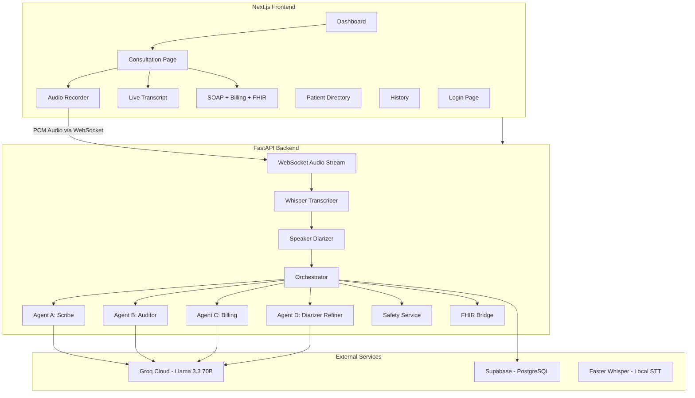

# 🛡️ Project Cura — Agentic Clinical Documentation OS

> AI-powered healthcare documentation platform with real-time voice transcription, multi-agent SOAP note generation, automated ICD-10 billing, clinical safety auditing, and FHIR-compliant output.

---

## 🏗️ Architecture



## 🧠 Multi-Agent Pipeline

| Agent | Model | Role |
|-------|-------|------|
| **Scribe** | Llama 3.3 70B | SOAP note generation with multilingual translation |
| **Auditor** | Llama 3.1 8B | Clinical accuracy validation, hallucination detection |
| **Billing** | Llama 3.1 8B | ICD-10-CM code extraction, intent classification |
| **Diarizer** | Llama 3.1 8B | Speaker label refinement (Doctor vs Patient) |

## ⚡ Tech Stack

| Layer | Technology |
|-------|-----------|
| **Frontend** | Next.js 14, TypeScript, TailwindCSS |
| **Backend** | FastAPI, Python 3.11 |
| **Speech-to-Text** | Faster Whisper (local, CPU-optimized) |
| **LLM** | Groq Cloud (Llama 3.3 70B + Llama 3.1 8B) |
| **Database** | Supabase (PostgreSQL) |
| **Auth** | JWT (PyJWT) |
| **Interop** | HL7 FHIR R4 |
| **Container** | Docker + Docker Compose |

## 🚀 Quick Start

### Prerequisites
- Python 3.10+
- Node.js 18+
- Groq API key ([console.groq.com](https://console.groq.com))
- Supabase project ([supabase.com](https://supabase.com))

### 1. Clone & Configure
```bash
git clone <your-repo-url>
cd Document\ Agent
cp .env.example .env
# Edit .env with your actual API keys
```

### 2. Set Up Database
Run the SQL migration in your Supabase SQL Editor:
```bash
# Copy contents of backend/migrations/001_create_tables.sql
# Paste into Supabase SQL Editor → Run
```

### 3. Start Backend
```bash
cd backend
python -m venv .venv
.venv\Scripts\activate  # Windows
pip install -r requirements.txt
uvicorn app.main:app --reload --host 0.0.0.0 --port 8000
```

### 4. Start Frontend
```bash
cd frontend
npm install
npm run dev
```

### 5. Open App
- Frontend: http://localhost:3000
- API Docs: http://localhost:8000/docs
- Default login: `admin` / `admin123`

## 🐳 Docker Deployment

```bash
# Build and start all services
docker-compose up --build

# Or in detached mode
docker-compose up -d --build

# Check status
docker-compose ps

# View logs
docker-compose logs -f backend
```

## 🧪 Running Tests

```bash
cd backend
pip install pytest pytest-asyncio httpx
python -m pytest tests/ -v
```

## 📁 Project Structure

```
Document Agent/
├── backend/
│   ├── app/
│   │   ├── agents/          # AI agents (Scribe, Auditor, Billing, Diarizer)
│   │   ├── api/             # REST routes & WebSocket handler
│   │   ├── middleware/      # Auth (JWT) & Rate Limiter
│   │   ├── models/          # Pydantic schemas & database client
│   │   ├── services/        # Transcriber, Safety, FHIR, Drug Safety
│   │   └── utils/           # ICD-10 lookup
│   ├── migrations/          # SQL migration scripts
│   ├── tests/               # pytest test suite
│   ├── Dockerfile
│   └── requirements.txt
├── frontend/
│   ├── src/
│   │   ├── app/             # Next.js pages (dashboard, consultation, patients, history, login)
│   │   ├── components/      # React components (clinical, consultation, layout, patients, ui)
│   │   ├── hooks/           # Custom hooks (useAuth, useToast, useWebSocket, etc.)
│   │   ├── lib/             # Utilities (API, constants, PDF generation)
│   │   └── types/           # TypeScript type definitions
│   ├── public/              # Static assets & PWA manifest
│   ├── Dockerfile
│   └── package.json
├── .env.example             # Environment variable template
├── .gitignore
├── .dockerignore
├── docker-compose.yml
└── README.md
```

## 🔒 Security Features

- **JWT Authentication** — Token-based auth with configurable expiry
- **PII Redaction** — Automatic masking of Aadhaar, PAN, phone, email, names
- **Rate Limiting** — Per-IP request throttling
- **Clinical Safety** — High-risk term flagging with mandatory review
- **Drug Interactions** — Automated drug-drug interaction checking
- **Audit Logging** — All access and actions logged for compliance
- **Non-root Docker** — Containers run as unprivileged users
- **RLS Policies** — Row-Level Security on Supabase tables

## 📊 API Endpoints

| Method | Path | Description |
|--------|------|-------------|
| `POST` | `/api/v1/auth/login` | Authenticate and get JWT |
| `GET` | `/api/v1/auth/me` | Current user info |
| `GET` | `/api/v1/health` | System health check |
| `POST` | `/api/v1/consultation/start` | Start consultation session |
| `POST` | `/api/v1/consultation/finalize` | Process transcript through AI pipeline |
| `GET` | `/api/v1/consultation/stats/dashboard` | Dashboard metrics |
| `GET` | `/api/v1/consultation/{id}` | Get consultation result |
| `GET` | `/api/v1/consultation/{id}/fhir` | Get FHIR bundle |
| `GET` | `/api/v1/patients/` | List patients |
| `POST` | `/api/v1/patients/` | Create patient |
| `GET` | `/api/v1/patients/{id}/history` | Patient consultation history |
| `POST` | `/api/v1/fhir/transmit/{session_id}` | Record FHIR transmission |
| `WS` | `/ws/v1/audio/{session_id}` | Real-time audio streaming |

## 🌐 Environment Variables

| Variable | Required | Description |
|----------|----------|-------------|
| `GROQ_API_KEY` | ✅ | Groq API key for LLM access |
| `SUPABASE_URL` | ✅ | Supabase project URL |
| `SUPABASE_KEY` | ✅ | Supabase anon/service key |
| `JWT_SECRET_KEY` | ✅ | Secret for JWT signing |
| `WHISPER_MODEL_SIZE` | ❌ | `tiny`, `base`, `small` (default: `small`) |
| `ADMIN_USERNAME` | ❌ | Default admin username (default: `admin`) |
| `ADMIN_PASSWORD` | ❌ | Default admin password (default: `admin123`) |

## 📜 License

This project is for educational and research purposes.

---

Built with ❤️ for healthcare innovation.
