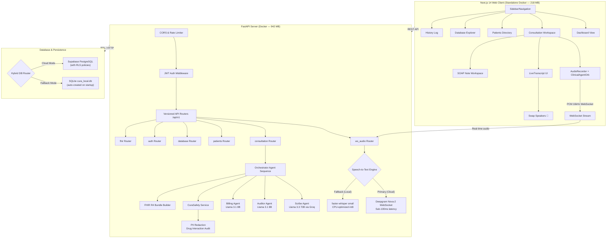

# 🛡️ Project Cura — Agentic Clinical Documentation OS

***Winner / Premier Submission for the Cognizant Technoverse Hackathon 2026 (Healthcare & Life Sciences Track)***

> AI-powered healthcare documentation platform with real-time voice transcription, multi-agent SOAP note generation, automated ICD-10 billing, clinical safety auditing, and FHIR-compliant output.

---

## 🏆 Cognizant Technoverse Hackathon 2026 Submission

Project Cura was developed as a flagship AI agent framework for the **Cognizant Technoverse Hackathon 2026**. It targets the massive administrative burden and burnout faced by modern physicians (saving up to 3 hours daily on clinical documentation).

### Key Hackathon Innovations:
1. **Agentic Orchestration & Bypass Logic:** Coordinates Scribe (Llama 3.3 70B), Clinical Auditor, and Billing Engine agents in an optimized sequence. Automatically bypasses diarizer LLM refinement when native Deepgram stream diarization is active, saving **2+ seconds** of finalization latency.
2. **Offline-First Resilience & Startup Lifespan Warming:** Implements a self-healing hybrid database engine. Supabase cloud schema and DNS connectivity are pre-checked and SQLite tables warmed during application **lifespan startup**, eliminating first-request latency. Instantly redirects queries locally to SQLite if the cloud connection encounters errors.
3. **Dual-Engine Speech-to-Text Pipeline:** Delivers sub-100ms real-time audio transcription over WebSockets utilizing **Deepgram Nova-2** (with native diarization and structural paragraph formatting) and a 30s heartbeat failsafe. Gracefully falls back to a CPU-optimized local **faster-whisper** engine under poor network states.
4. **Clinical Speaker Swapping & UI Polish:** Provides a custom glowing metallic SVG branding logo and visual audio waveform equalization canvas. Integrated an instant **"Swap Speakers"** (🔁) action control allowing physicians to correct diarization mismatches in a single click.
5. **HL7 FHIR & ICD-10 Compliant:** Auto-generates standard-compliant JSON FHIR bundles containing conditions, encounters, and medication requests mapped directly to official ICD-10-CM codes.

---

## 🏗️ Architecture & Systems Map



## 🧠 Multi-Agent Pipeline

| Agent | Model | Role |
|-------|-------|------|
| **Scribe** | Llama 3.3 70B (Groq) | SOAP note generation with multilingual translation |
| **Auditor** | Llama 3.1 8B (Groq) | Clinical accuracy validation, hallucination detection |
| **Billing** | Llama 3.1 8B (Groq) | ICD-10-CM code extraction, intent classification |
| **Diarizer** | Llama 3.1 8B (Groq) | Speaker label refinement (bypassed when Deepgram active) |

## ⚡ Tech Stack

| Layer | Technology |
|-------|-----------|
| **Frontend** | Next.js 14, TypeScript, TailwindCSS |
| **Backend** | FastAPI, Python 3.11, Uvicorn |
| **Primary STT** | Deepgram Nova-2 (Cloud WebSocket, native diarization) |
| **Fallback STT** | faster-whisper (local CPU, int8 quantized) |
| **LLM** | Groq Cloud (Llama 3.3 70B + Llama 3.1 8B) |
| **Database** | Supabase PostgreSQL (cloud) + SQLite (local fallback) |
| **Auth** | JWT (PyJWT) with admin bootstrap |
| **Interop** | HL7 FHIR R4, ICD-10-CM |
| **Container** | Docker multi-stage builds + Docker Compose |
| **Deployment** | Render.com (free tier) |

## 🐳 Docker Image Sizes

| Service | Image Size | Notes |
|---------|-----------|-------|
| **Frontend** | **218 MB** | Next.js standalone output, tree-shaken |
| **Backend** | **942 MB** | Python 3.11-slim + faster-whisper + dependencies |

## 🚀 Quick Start

### Prerequisites
- Python 3.10+
- Node.js 18+
- Groq API key ([console.groq.com](https://console.groq.com))
- Supabase project ([supabase.com](https://supabase.com))
- Deepgram API key ([console.deepgram.com](https://console.deepgram.com)) — *optional but recommended*

### 1. Clone & Configure
```bash
git clone https://github.com/SatyaPrakash252/Agent-CURA.git
cd Agent-CURA
cp .env.example .env
# Edit .env with your actual API keys
```

### 2. Set Up Database
Run the SQL migration in your Supabase SQL Editor:
```bash
# Copy contents of backend/migrations/001_create_tables.sql
# Paste into Supabase SQL Editor → Run
```

> **Note:** If you skip this step, Project Cura automatically falls back to a local SQLite database (`cura_local.db`) — no setup required!

### 3. Start Backend
```bash
cd backend
python -m venv .venv
.venv\Scripts\activate  # Windows
pip install -r requirements.txt
uvicorn app.main:app --reload --host 0.0.0.0 --port 8000
```

### 4. Start Frontend
```bash
cd frontend
npm install
npm run dev
```

### 5. Open App
- Frontend: http://localhost:3000
- API Docs: http://localhost:8000/docs
- Default login: `admin` / `admin123`

## 🐳 Docker Deployment (Local)

```bash
# Build and start all services
docker-compose up --build -d

# Check status (both should show "healthy")
docker-compose ps

# View logs
docker-compose logs -f backend

# Stop
docker-compose down
```

## ☁️ Cloud Deployment (Render.com)

Project Cura includes a `render.yaml` blueprint for one-click deployment to [Render.com](https://render.com) (free tier).

### Steps:
1. **Push to GitHub** — Ensure your repo is up to date
2. **Connect to Render** — Go to [Render Dashboard](https://dashboard.render.com) → **New** → **Blueprint**
3. **Select Repository** — Choose your `Agent-CURA` repo
4. **Configure Environment Variables** — Set these in the Render dashboard:
   - `GROQ_API_KEY` — Your Groq API key
   - `SUPABASE_URL` — Your Supabase project URL
   - `SUPABASE_KEY` — Your Supabase anon key
   - `DEEPGRAM_API_KEY` — Your Deepgram API key
   - `ADMIN_PASSWORD` — Choose a secure admin password
5. **Deploy** — Render will automatically build and deploy both services

### Important Notes:
- After the backend deploys, update the frontend's `NEXT_PUBLIC_API_BASE_URL` to point to your actual backend URL (e.g., `https://project-cura-backend.onrender.com`)
- Update the backend's `CORS_ORIGINS` to include your frontend URL
- Free tier services spin down after inactivity; first request may take 30-60 seconds

## 🧪 Running Tests

```bash
cd backend
pip install pytest pytest-asyncio httpx
python -m pytest tests/ -v
```

**Result:** 52 tests passing (safety, schemas, FHIR, routes)

## 📁 Project Structure

```
Agent-CURA/
├── backend/
│   ├── app/
│   │   ├── agents/          # AI agents (Scribe, Auditor, Billing, Diarizer)
│   │   ├── api/             # REST routes & WebSocket handler
│   │   ├── middleware/      # Auth (JWT) & Rate Limiter
│   │   ├── models/          # Pydantic schemas & database client
│   │   ├── services/        # Transcriber, Safety, FHIR, Drug Safety
│   │   └── utils/           # ICD-10 lookup
│   ├── migrations/          # SQL migration scripts
│   ├── tests/               # pytest test suite (52 tests)
│   ├── Dockerfile           # Multi-stage Python 3.11-slim build
│   └── requirements.txt
├── frontend/
│   ├── src/
│   │   ├── app/             # Next.js pages (dashboard, consultation, patients, history, login, database)
│   │   ├── components/      # React components (clinical, consultation, layout, patients, ui)
│   │   ├── hooks/           # Custom hooks (useAuth, useToast, useWebSocket)
│   │   ├── lib/             # Utilities (API, constants, PDF generation)
│   │   └── types/           # TypeScript type definitions
│   ├── public/              # Static assets & PWA manifest
│   ├── Dockerfile           # Multi-stage Node 18-alpine standalone build
│   └── package.json
├── .env.example             # Environment variable template
├── .gitignore
├── .dockerignore
├── docker-compose.yml       # Local Docker orchestration
├── render.yaml              # Render.com deployment blueprint
├── SETUP_GUIDE.md           # Detailed setup instructions
└── README.md
```

## 🔒 Security Features

- **JWT Authentication** — Token-based auth with configurable expiry
- **PII Redaction** — Automatic masking of Aadhaar, PAN, phone, email, names
- **Rate Limiting** — Per-IP request throttling (30 req/min default)
- **Clinical Safety** — High-risk term flagging with mandatory review
- **Drug Interactions** — 12+ interaction pairs, dosage range validation
- **Audit Logging** — All access and actions logged for compliance
- **Non-root Docker** — Containers run as unprivileged `cura` user
- **RLS Policies** — Row-Level Security on Supabase tables
- **CORS Protection** — Configurable allowed origins via environment variable

## 📊 API Endpoints

| Method | Path | Description |
|--------|------|-------------|
| `POST` | `/api/v1/auth/login` | Authenticate and get JWT |
| `POST` | `/api/v1/auth/signup` | Doctor self-registration |
| `GET` | `/api/v1/auth/me` | Current user info |
| `GET` | `/api/v1/health` | System health check |
| `POST` | `/api/v1/consultation/start` | Start consultation session |
| `POST` | `/api/v1/consultation/finalize` | Process transcript through AI pipeline |
| `GET` | `/api/v1/consultation/stats/dashboard` | Dashboard metrics |
| `GET` | `/api/v1/consultation/{id}` | Get consultation result |
| `GET` | `/api/v1/consultation/{id}/fhir` | Get FHIR bundle |
| `GET` | `/api/v1/patients/` | List patients |
| `POST` | `/api/v1/patients/` | Create patient |
| `GET` | `/api/v1/patients/{id}/history` | Patient consultation history |
| `GET` | `/api/v1/database/tables` | List database tables |
| `GET` | `/api/v1/database/tables/{name}` | Browse table rows |
| `POST` | `/api/v1/fhir/transmit/{session_id}` | Record FHIR transmission |
| `WS` | `/ws/v1/audio/{session_id}` | Real-time audio streaming + transcription |

## 🌐 Environment Variables

| Variable | Required | Description |
|----------|----------|-------------|
| `GROQ_API_KEY` | ✅ | Groq API key for LLM access |
| `SUPABASE_URL` | ✅ | Supabase project URL |
| `SUPABASE_KEY` | ✅ | Supabase anon/service key |
| `DEEPGRAM_API_KEY` | ⭐ | Deepgram API key for cloud STT (highly recommended) |
| `JWT_SECRET_KEY` | ✅ | Secret for JWT signing (auto-generated on Render) |
| `WHISPER_MODEL_SIZE` | ❌ | `tiny`, `base`, `small` (default: `small`) |
| `ADMIN_USERNAME` | ❌ | Default admin username (default: `admin`) |
| `ADMIN_PASSWORD` | ❌ | Default admin password (default: `admin123`) |
| `CORS_ORIGINS` | ❌ | Comma-separated allowed origins (default: localhost) |
| `NEXT_PUBLIC_API_BASE_URL` | ❌ | Backend URL for cloud frontend builds |

## 📜 License

This project is for educational and research purposes.

---

Built with ❤️ for healthcare innovation.
